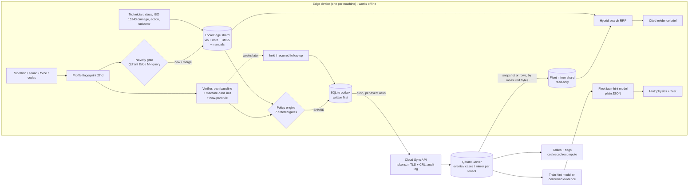

# Machine Memory at the Edge

**Offline fault memory for machines and other edge devices, built on Qdrant Edge.** Each device remembers fault
episodes and what fixed them, and searches that memory with no network. It shares a fix with the fleet **only
after the device's own sensor data shows the fix held** - and reports weeks later whether it **still** held. The cloud
groups the evidence by fault and **keeps disagreement visible instead of overwriting it**. Other devices use that
evidence offline, and the fleet **learns fault types from what technicians confirmed**. A phone can be the sensor:
its **microphone** hears bearing faults its 60 Hz motion sensor cannot.

> Qdrant hackathon PS3 (Code Cubicle 6.0). The system **shows evidence, physics, the manufacturer's own manual pages
> and cited procedures; it never generates a recommendation, and nothing is shared without a sensor-verified outcome.**

Every number below comes from a script in `bench/` or a test in `tests/`, on real public data, run on the laptop in
[Measurements](#measurements). Anything not measured is labelled. Nothing is trained on made-up data.

---

## What is actually different

Offline vector search, sync and conflict logs are table stakes (CouchDB, Couchbase Lite, ObjectBox). We claim the
**combination**, and we measured it:

1. **Outcome-verified promotion, twice.** After a repair the device counts consecutive windows back inside *its own*
   healthy state - and, with a **machine card**, below the **manufacturer's vibration limit**. A replaced part is
   judged by a parameter-free "nearer to healthy than to the fault" rule (a new bearing never matches the old
   baseline). Only then may the fix leave the device. **Weeks later** the device reports whether the fix **held** or the
   fault **recurred**. Failed fixes are shared too. The UI says "symptom resolved", never "root cause confirmed".
2. **Disagreement is evidence.** Counts per (fault group, action): worked, failed, held, recurred, distinct sites.
   Flags `DISPUTED`, `COMPETING`, `ALTERNATIVES`, `RECURRED`. No trust score, nothing overwritten; retraction is a
   tombstone and needs **two admins**.
3. **The fleet learns fault types.** Technicians record what they SAW on the removed part (ISO 15243 damage modes).
   Physics numbers travel with that confirmed evidence; the cloud trains a small model, measures it on devices it
   never saw, and devices pull it. A hint is marked **confident only when physics and the fleet model agree**.
4. **Device B benefits offline** through a read-only fleet-mirror shard: **Qdrant's documented dual-shard pattern**
   (not our invention), filled from Qdrant shard snapshots or rows, whichever is cheaper in measured bytes.
5. **Tested where it was never tuned:** three bearing labs (CWRU, HUST, University of Ottawa - natural wear), real
   motors, real robots, real trucks, real system logs.

## One engine, many kinds of edge device

Each **signal profile** turns its input into the same 27-number fingerprint; the gate, verifier, policy, sync and
cloud are shared ([`edge/profiles.py`](edge/profiles.py)).

| Profile | Device / sensor | Measured on real data |
|---|---|---|
| `bearing-12k` | industrial motor, 12 kHz accelerometer | CWRU: fixes verified 36/36, still-faulty caught 36/36, 0 false promotions |
| `rotating-hf` | any rotating machine, accelerometer >= 2 kHz, **any bearing geometry** | HUST (5 bearing types, held out): fault-type hint **95.2 %**, fixes verified **42/42**; UOttawa natural wear: **0/620** false alarms, 97 % of faulty windows flagged |
| `acoustic` | **phone microphone** (44.1/48 kHz) or any mic next to a machine | UOttawa (natural wear, 20 bearings): **0/380 false alarms**, **95.7 %** of faulty windows flagged, new bearing verified **19/20** |
| `lowrate-accel` | phone motion sensor / IMU / telematics, ~60 Hz | shaft-rate faults only, says when a fault is beyond its Nyquist limit |
| `force-torque` | **robot** wrist sensor | UCI: gate + the robot's own learned detector: **96-99 %** of failures, **0-10 %** false alarms |
| `events` | **kiosks, apps, vehicle fault codes** | Loghub HDFS real logs: **99.98 %** of failed sessions, **0.39 %** false alarms; 9,533 vehicle codes explained offline (OBDex) |
| `telemetry` | **vehicle / machine counters** | SCANIA real trucks: risk hint ROC-AUC **0.75** on 5,045 held-out trucks |

A phone is the **sensor and the screen** (installable web app; `/sensor` streams microphone or motion data over
HTTPS). A cheap MEMS accelerometer can feed a device through `tools/sensor_bridge.py`. The edge device runs where
`qdrant-edge-py` 0.8.0 publishes packages (verified on PyPI): **Windows, Linux x86-64 and ARM64 (e.g. Raspberry Pi
4/5), macOS Intel and Apple Silicon**. Tested on Windows 11; a CI workflow for Linux/macOS/Windows is ready
([.github/workflows/tests.yml](.github/workflows/tests.yml), not yet run - the repo is not on GitHub).

## Helping to fix, not only to remember

For every episode the device shows (deterministic or measured, never generated):
- **physics:** defect frequencies from the bearing's geometry and speed, the order rule relative to this machine's
  healthy state, a severity zone from **ISO 10816-3 (tables read from the standard)** or the **manufacturer's limits**;
- the **fault-type hint** with its confidence (physics + fleet model) and the measured accuracy;
- **the machine's own manuals**, searched offline with **page numbers** (PDF upload, hybrid search on the device);
- **documented procedures** with their sources (SKF, balancing, alignment, lubrication) and the site's own SOPs;
- **similar past cases** from this machine and from the fleet, with outcomes, and an optional cited AI summary.

The technician acts; the sensor verifies. "Not a fault: normal operation" teaches a new healthy state; "teach a
failure" records one the sensor missed (robots learn from it).

## Asking it things

The same Qdrant Edge shard that holds fault episodes also holds free text, so the device can be asked
questions in plain language - offline, with citations, and with an honest answer when it has nothing.

- **It ships knowing things.** An empty device can only ever say "I do not know", so first boot loads the
  reference material this repository already carries: **9,533 standard OBD fault codes** with causes and
  repair times, plus cited maintenance procedures. Ask `P0420` and it answers; describe a symptom and it
  finds the code. A named code is looked up exactly - among ~9.5k near-identical entries the dense leg is
  close to noise, and asking for P0420 used to return P0422 because that entry *mentions* P0420.
- **Teach it anything.** Free text becomes a searchable memory, in any domain. It never syncs.
- **Follow-up questions work.** "How long does *it* run" inherits the subject of the previous question -
  the question only, never the previous answer, so the device cannot cite itself as a source. A question
  that names its own subject keeps to it.
- **It distinguishes two failures.** Nothing sharing a single word with the question means the subject is
  outside what this device holds, and it says so - that needs teaching or a connection. A near miss says so
  instead, and asks you to name the part or code.
- **Speech, on the device, in English or Hindi.** Whisper `small` (faster-whisper, ~480 MB, MIT, CPU) detects the
  language itself and writes Hindi in Devanagari; Vosk (40 MB, English only) remains as a fallback. The browser's own
  speech API would have been one line of JavaScript, but on most platforms it uploads the audio; that would break
  the offline claim. Measured on synthetic speech only: English correct, Hindi detected at 98 % with one misheard
  word in a sentence; a 5 s clip takes 6-13 s on a laptop CPU (Whisper always processes a 30 s window).
- **Answers in the language you asked in (Hindi / English).** The whole answer pipeline is English, so a Hindi
  question is translated to English, answered by the same grounded pipeline, and the answer is translated back,
  with two small offline models (opus-mt hi-en / en-hi, ~78 MB each, CTranslate2, no torch at run time). Whole-record
  questions, the device's standard messages and episode summaries are hand-written Hindi, because machine
  translation garbled them; everything else is machine-translated, flagged as such in the UI with the English
  original one click away. Identifiers, numbers and `[E1]` markers are never sent through the translator. Hindi typed
  in Latin letters is read as English; cited source snippets stay in English.
- **Photographs are retrieved, never described.** Qdrant's CLIP pair puts pictures and words in one 512-d
  space, so typing "cracked housing" finds the photo. Nothing reads the image and states what is wrong with
  it: a vision-language model would confidently misread a spalled race, and a nearest-neighbour hit makes no
  claim at all. The note a person wrote beside the photo carries the meaning.
- **Broadcast.** Text addressed to every device, a whole site, or named devices. The audience filter runs in
  the cloud's query, so a device is never handed a record meant for somebody else and merely told to hide it.
  Withdrawing leaves a tombstone so recipients delete their copy; a record already read cannot be recalled.
- **The Qdrant tab shows the work.** Vectors searched, which kinds of memory were queried, which legs were
  compared and at what size, and the timing - reported from the search that ran, not recomputed for display.

## Architecture



| Component | Role | Who built it |
|---|---|---|
| Qdrant Edge (`qdrant-edge-py` 0.8.0) | local shard: named vectors, one-request hybrid + RRF, filters, facets, conditional upserts, snapshots | Qdrant |
| Qdrant Server 1.19.1 | fleet collections, `insert_only` ingest, CAS case updates, shard snapshots for the mirror | Qdrant |
| `edge/profiles.py`, `edge/physics.py` | fingerprints; defect frequencies, envelope + kurtogram, relative order rule, ISO severity | ours |
| `edge/gate.py`, `edge/verifier.py` | novelty gate; verification with limits, new-part rule, follow-ups | ours |
| `edge/fleet_hint.py`, `cloud/hint_model.py` | fleet-learned fault hint, trained on confirmed evidence, measured on unseen devices | ours |
| `edge/machine_card.py`, `edge/manuals.py` | manufacturer data; offline manual search with page citations | ours |
| `edge/local_detector.py` | a robot's own detector from its confirmed failures | ours |
| `edge/policy.py`, `edge/outbox.py`, `edge/sync_worker.py`, `edge/mirror.py` | share decision with reasons, journal-first writes, acks, mirror | ours (mirror pattern: Qdrant) |
| `cloud/*` | auth, ingest, tallies, flags, two-admin retraction, quarantine, audit, coalesced recompute | ours |
| `shared/redact.py`, `shared/name_model.py` | redactor + name detection trained on real names | ours; names: Wikidata (CC0) |
| bge-small-en-v1.5 (FastEmbed), Qwen2.5-1.5B (llama.cpp) | note embeddings; optional cited summary, outside every decision | BAAI, Qwen |

### Machine learning here - every model trained on real data only

| Model | Trained on (real) | Measured on data it never saw | In a decision? |
|---|---|---|---|
| Fleet fault-type hint (logistic regression, order features) | technician-confirmed cases of the fleet | HUST 95 %, UOttawa 70-73 %; confident: 100 / 92 / 85 % | no - the technician confirms |
| Robot learned detector (logistic regression) | the robot's own healthy data + confirmed failures | UCI: 96-99 % detection, 0-10 % false alarms | adds alarms only |
| Vehicle risk hint (logistic regression) | SCANIA validation trucks | 5,045 test trucks: AUC 0.75 | no - shown as a hint |
| Name-likeness (character n-grams) | Wikidata given names vs logbook words | unseen names: 85-95 % | makes sharing stricter only |
| bge-small, Qwen2.5 | pre-trained by their makers | retrieval P@3 0.885 | no |

Made-up data appears **only inside tests** (e.g. a sine wave whose answer is known).

**Privacy:** raw signals and raw notes never leave the device; text embeddings are never shipped (embedding
inversion); a note is shared only on opt-in **and** only if the redactor finds nothing; manuals never leave the device.

**The one exception, and it is opt-out:** Ask can also look things up on the internet, because a device that
answers "I do not know" to *"who is the current president of France"* while connected is not being careful,
it is being useless. What leaves the device is **the question text and nothing else** - no episode, note,
fingerprint, embedding, device id, site id or machine id (`edge/online.py` is the only module on the device
that reaches the network). Three settings, in **Settings -> Ask**:

| Mode | What happens |
|---|---|
| This device only | Nothing ever leaves. The original behaviour. |
| This device first, then the internet (**default**) | Only a question the device cannot answer is looked up. |
| Always check the internet too | Every question is also searched online. |

A question about this machine's own record ("what problems have you seen?") **never** leaves the device in any
mode, and every answer states on its face whether it came from the device, the internet, or both.
Web search needs no account by default (DuckDuckGo + Wikipedia). To use a keyed provider instead, set
`EDGE_SEARCH_PROVIDER=brave` with `BRAVE_SEARCH_API_KEY`, or `=tavily` with `TAVILY_API_KEY`; `=none` disables
it entirely.

## Measurements

Laptop: Intel i5-1335U, 15.7 GB RAM, no GPU, Windows 11, Python 3.12. Raw JSON in `bench/results/`; methods and
caveats in [docs/BENCHMARKS.md](docs/BENCHMARKS.md).

### Can the sensor verify a fix?
| Data | Fixed verified | Still-faulty caught | False promotions |
|---|---|---|---|
| CWRU, 36 fault recordings (`bench/gate_verifier.py`) | **36/36** | **36/36** | **0** |
| HUST, 5 bearing types held out, healthy at a load never taught (`bench/hust_holdout.py`) | **42/42** | **38/39** | **0** |
| UOttawa, natural wear, same bearing / **new bearing** (`bench/acoustic_uottawa.py`, mic) | **20/20** / **19/20** | **19/20** | - |

Gate false alarms: CWRU 0/116, UOttawa 0/1,000 (mic + accelerometer). A healthy machine at an untaught load is
flagged (HUST 92/305 windows) until "normal operation" is confirmed once (then 4/255).

### Which fault? (`bench/fault_hint.py`, always on bearings the model never saw)
| Data | Physics | Fleet model | Correct when "confident" (share of recordings) |
|---|---|---|---|
| HUST | 97.6 % | 95.2 % | **100 %** (93 %) |
| UOttawa accelerometer, natural wear | 35 % | **72.5 %** | **92 %** (33 %) |
| CWRU | 69 % | 67 % | 85 % (75 %) |
| UOttawa microphone | 33 % | 70 % | 71 % (35 %) |

The fleet model improves as technicians confirm cases: 2 -> 19 confirmed bearings: 33 % -> 72-76 %. When the hint is
not confident the UI says "inspect"; the fleet always groups by the technician-confirmed class.

### Fleet of devices at once (`bench/fleet_scale.py`, real Qdrant Server over HTTP, all on one laptop)
| Fleet | All pushes done | Lost / counted twice | Every mirror equal to the cloud |
|---|---|---|---|
| 1,000 devices + 50 complete Edge devices (10,500 events) | **34.7 s** | **0 / 0** | yes (1,050) |
| 5,000 devices + 50 complete (10,100 events) | **91.3 s** | **0 / 0** | yes (5,050) |
| 1,000 devices waking within 3 s (burst) | **23.9 s, 419 events/s** | **0 / 0** | yes |

A complete device pulls the fleet mirror in 3.9 s (p50) while 10 others do the same. The limit is the single cloud
process (~0.8 CPU cores, measured), not Qdrant (0.4 cores). Bad networks (`bench/network_faults.py`: slow, 40 % cut,
stalls, flapping, all at once) and wrong device clocks (+3 days, -2 days): **0 lost, 0 counted twice**, clocks corrected
to 1 s. Partitions and restarts (`bench/sync_partition.py`): **0 lost, 0 duplicates**. Every device function with all
network access blocked (`bench/offline_check.py`): **15/15, 0 connection attempts**.

### Other real-data results
| What | Result | Where |
|---|---|---|
| Hybrid search on real maintenance text (6,169 records) | P@3 **0.885**, MRR 0.93, capped recall 0.88 - best of dense / BM25 / hybrid on every metric | §29 |
| Fingerprint similarity across machines (why the fleet groups by confirmed class) | leaky split 0.997 vs honest bearing-level **0.429** | §3 (K2) |
| Names in notes that nobody listed | 95 % found in normal typing, 85-87 % in ALL CAPS / lower case (was 0/60); clean notes kept local 0.8-2.6 % | §26 |
| Real drive-fed motors: healthy / faulty | no alarm **8/8**; faulty detected **16/16** (one motor per fault, so naming could not be tested) | §24 |
| One real machine with imbalance and misalignment (MaFaulDa, 831 recordings) | imbalance named **258/333** (was 0; 34 wrong); misalignment detected 66-74 % of windows but named only 2-15 times - mostly "inspect" | §32 |
| Robots, subtle failures | gate alone 36-55 % -> with the robot's learned detector **96-99 %** | §27 |
| Real trucks, early warning | AUC 0.75; top 10 % alerts catch 32 % of repairs (3.4x base rate). A bigger training set was tried: worse, rejected | §20, §28 |

### Latency and resources (`bench/latency.py`, `bench/resources.py`)
Gate decision 0.21 ms; hybrid query on Edge 0.50 / 1.06 / 1.97 ms at 1k / 10k / 50k points; durable write 32 ms;
real-time monitoring 16.5 % of one core, ~0.3 GB RAM. One shared fix is ~0.9 kB; the raw signal it summarises
(~500 kB) never leaves the device.

## Tests

`.venv\Scripts\python.exe -m pytest` runs **302 tests, all passing** on the machine above (~9.5 min; 0 skipped with
the data sets downloaded). Some tests start the real Qdrant Server binary themselves.

| Folder | What it proves |
|---|---|
| `tests/unit` | fingerprint and physics maths on known answers; machine card and ISO tables; fleet hint training and tamper checks; microphone route; manuals with page citations; redactor and name detection; sensor bridge; schema; Edge store |
| `tests/integration` | on real CWRU: learn -> verify -> share -> cloud -> Device B offline; order features + damage mode reach the cloud; the fleet trains a hint model and devices use it; held / recurred follow-ups; manufacturer limit blocks "fixed"; new-part rule; real UCI robots learn from confirmed failures; coalesced recompute is never stale; fleet mirror via real Qdrant snapshots |
| `tests/failure` | hard kill loses 0 acknowledged writes; partition harness; offline checklist; backup / restore (damaged archive refused; cloud restore from Qdrant snapshots) |
| `tests/security` | tokens, roles, tenants, replay, forged ids, two-admin retraction, quarantine, audit-chain tampering detected, implausible evidence rejected, code-integrity status, CSP headers, TLS >= 1.2, revoked device certificate refused, weak operator token refused, no secrets in the repo |
| `tests/ai` | cited-summary checker, prompt-injection echo removed |

Also `demo/scenario.py` (end-to-end against the running system) and `tests/ui_check.py` (headless browser, fails on
any console error).

## Run it

Requirements: Python 3.12, `uv`. Tested on Windows 11. No Docker.

```powershell
uv venv .venv --python 3.12
$env:VIRTUAL_ENV=".venv"; uv pip install -r requirements.txt --extra-index-url https://abetlen.github.io/llama-cpp-python/whl/cpu --index-strategy unsafe-best-match
.venv\Scripts\python.exe data\fetch_data.py            # CWRU + logbook (not redistributed)
.venv\Scripts\python.exe -m bench.retrieval_vib        # builds the fingerprint cache
.venv\Scripts\python.exe -m tools.qdrant_local download  # Qdrant Server 1.19.1 for this OS into qdrant_server\
powershell -ExecutionPolicy Bypass -File start.ps1     # everything, then opens the app
```

Then **http://127.0.0.1:9000** - one page, no sign-in. The gateway (`app/unified.py`) holds the tokens and
proxies to the device and the cloud, so nobody has to paste one. `stop.ps1` stops everything.

| Tab | What it is for |
|---|---|
| **Ask** | type, dictate or attach a photo; answers cite what they came from, and say plainly when nothing matches |
| **Memory** | what you added, what was shared with you, photos, past conversations, what the sensor noticed |
| **Broadcast** | send text to every device, a whole site, or named devices - the audience filter runs on the server |
| **Devices** | the device kinds this one engine covers |
| **Qdrant** | the last search exactly as it ran: vectors searched, where it looked, which legs compared, timing |
| **Sync** | what stays local, what is queued, roughly how many kB before you send it |

The scripted three-device proof still exists:
`powershell -ExecutionPolicy Bypass -File demo\run_demo.ps1 -Reset` then `.venv\Scripts\python.exe -m demo.scenario`
(devices on 8101/8102/8103, cloud on 8100, tokens in `runtime\cloud\bootstrap.json`).

**First run takes a few minutes and blocks:** the device embeds ~9.5k reference records so it can answer
something before anyone has taught it anything. Photo search fetches its model on first use (Qdrant CLIP 590 MB);
voice and Hindi need `python -m tools.build_language_models` once (Whisper ~480 MB + two ~78 MB translation
models). All are offline afterwards and optional; the app runs without them.

For a phone, a second computer or production (HTTPS, mutual TLS, certificate revocation, strong tokens, backups):
[docs/SETUP.md](docs/SETUP.md). Real-world test plan: [docs/FIELD_TEST.md](docs/FIELD_TEST.md).

## Documents
| File | What |
|---|---|
| [docs/BENCHMARKS.md](docs/BENCHMARKS.md) | every number, its script, method and caveat (§1-29) |
| [docs/DECISIONS.md](docs/DECISIONS.md) | what changed during the build and the measurement behind it (D1-D40) |
| [docs/THREATS.md](docs/THREATS.md) | threat -> mitigation -> residual risk -> the test that proves it |
| [docs/DEMO.md](docs/DEMO.md), [docs/SETUP.md](docs/SETUP.md), [docs/FIELD_TEST.md](docs/FIELD_TEST.md) | demo run, installation and production, real-world tests |
| [docs/RESEARCH.md](docs/RESEARCH.md) | the original research and architecture (history; this README and the docs above are current) |

## Honest limits

- **No field deployment yet.** Every result is on public recordings (three bearing labs, real motors, robots, trucks,
  logs); no real plant, no real technician, and the multi-device runs are on one laptop. The two-computer, phone and
  technician tests are written ([docs/FIELD_TEST.md](docs/FIELD_TEST.md)) and not yet run.
- **Sensor-verified is not root cause confirmed**; the root cause comes from the technician's inspection (ISO 15243).
- **Fault TYPE from vibration alone is hard where the physics is weak:** 33-35 % on naturally worn bearings by physics,
  70-73 % with the fleet model; the system says "inspect" instead of guessing, and the fleet uses confirmed classes.
- **Misalignment is detected but rarely named** (MaFaulDa, one real machine: 2-15 of 197-301 recordings named right,
  28-55 wrong, the rest "inspect"); imbalance is named 77 % on the best channel. The HUST bearing hint paid 1 recording
  for this (97.6 -> 95.2 %, D46).
- **Microphone:** a neighbouring machine that starts later causes false alarms (60-100 % of windows) until one
  "normal operation" confirmation (then 0-4 %); a neighbour as loud or louder then hides 30-66 % of faulty windows
  (BENCHMARKS §33). No calibrated severity from sound. Use an accelerometer where machines are loud.
- **Vehicles:** the risk hint is modest (AUC 0.75); variables are anonymised, so it cannot explain why.
- **Names:** names not on the 10,562-name list are missed 13-15 % of the time in ALL CAPS / lower-case notes (25 % on
  phrasings written after the rules); such notes are shared only if nothing is flagged, and notes stay local by default.
- **Security is prototype-grade but complete in its basics** (tokens with expiry, HTTPS, mutual TLS with revocation,
  notes encrypted at rest, two-admin retraction, quarantine, audit chain). Not built: hardware attestation (the code
  check is tamper evidence), encryption of searchable structured fields (use disk encryption).
- **Disk:** each Qdrant Edge shard pre-allocates ~200 MB (Windows NTFS compression measured 267 MB -> 1.9 MB).
- **Asking it things is newer than the rest and less measured.** Known gaps: a single shared word is treated as a
  match, so an off-topic question can return a record that merely contains the word ("what is harsh" returns a
  transmission code); first boot blocks for minutes while the reference pack is embedded; the device kind is fixed
  at launch, so the Devices tab lists seven but you cannot switch between them from the UI; video is not wired
  (the frame sampler exists, unused) and there is no OCR, so a nameplate or dashboard code in a photo is not read.
  Retrieval, follow-ups, pictures and sharing have tests; the speech, broadcast and Qdrant screens were checked
  by hand only.
- **The optional LLM is small** (1.5B); its sentences must cite evidence and never advise; a reading aid only.
- **Licence:** Apache-2.0 ([LICENSE](LICENSE), [NOTICE](NOTICE)). Data sets are not redistributed; derived word and
  name lists in `knowledge/` credit their sources.

## Data and credits

- **CWRU Bearing Data Center** (no explicit licence found; downloaded, not redistributed).
- **HUST bearing:** Hong & Thuan 2023, DOI 10.17632/cbv7jyx4p9.3, CC BY 4.0.
- **University of Ottawa** bearing (DOI 10.17632/y2px5tg92h.1) and motor (DOI 10.17632/msxs4vj48g.2) datasets,
  Sehri, Dumond et al., CC BY 4.0.
- **MaFaulDa** Machinery Fault Database, Ribeiro et al., UFRJ SMT (no licence text published; used for evaluation
  only, not redistributed).
- **UCI Robot Execution Failures:** Lopes & Camarinha-Matos 1998, DOI 10.24432/C5M89N, CC BY 4.0.
- **SCANIA Component X:** Scania CV AB, DOI 10.5878/jvb5-d390, CC BY 4.0.
- **Loghub HDFS_v1:** He et al., DOI 10.5281/zenodo.8196385, CC BY 4.0 (labels: Xu et al., SOSP 2009).
- **Annotated Maintenance Logbook:** Zenodo 17903357, CC BY 4.0 (from MaintNet); `knowledge/domain_vocab.json` is derived.
- **Wikidata** given names, CC0 (`knowledge/given_names.json`). **OBDex** vehicle codes, CC0.
- **Standards and references:** ISO 10816-3:1998 Annex A (values), ISO 15243:2017 classes as summarised by SKF;
  procedure sources in `knowledge/procedures.json`.
- **Qdrant:** Edge, Server, FastEmbed, and the dual-shard sync pattern. **Models:** BAAI bge-small-en-v1.5 (MIT),
  Qwen2.5-1.5B-Instruct (Apache-2.0).
